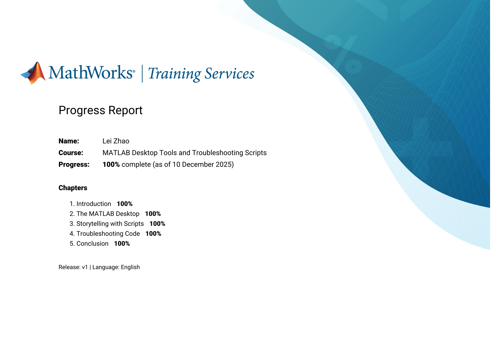

   
<h1>MathWorks</h1>

   

        
<h2>Simulink</h2>

            

            
<h3>Learn Path</h3>

                

                    
<h4>Control System Design with MATLAB and Simulink</h4>

                    
                        
Control System Modeling Essentials

                        
                        
Linearization of Nonlinear Systems

                        
                        
Control System Analysis Techniques

                        
                        
PID Control Techniques

                        
                        
Classical Controller Design Techniques

                        
                

            

   

   

        
<h2>Matlab</h2>

        

            
<h3>Learn Path</h3>

                

                    
<h4>Core MATLAB Skills</h4>

                    
                        
 MATLAB Desktop Tools and Troubleshooting Scripts

                        
                        
Explore Data with MATLAB Plots 

                        
                        
 Make and Manipulate Matrices 

                        
                        
Calculations with Vectors and Matrices

                        
                 

        

    

